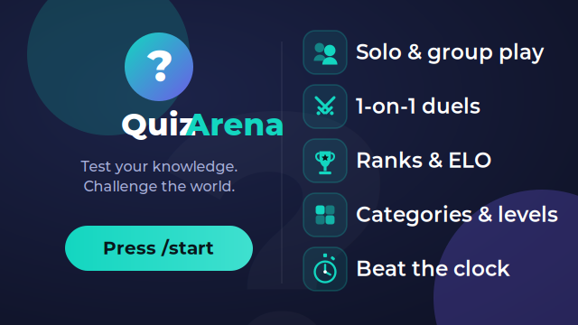
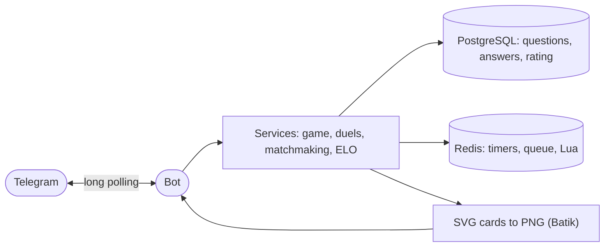

<p align="center">
  
</p>

<p align="center">
  <a href="https://github.com/Sch1z0eD/quiz-arena-telegram/actions/workflows/ci.yml"></a>
  <a href="LICENSE"></a>
  
  
  
  
  
</p>

<p align="center">
  <a href="README.md">Русский</a> · <b>English</b>
</p>

# QuizArena

A Telegram quiz bot. Play on your own, with a whole chat, or go head-to-head in a one-on-one duel — with ratings, leaderboards, and questions in both Russian and English.

Type `/start` to begin; everything after that runs through inline menu buttons. The bot is written in Java 21 and Spring Boot. Anything that has to be fast and atomic — round timers, double-answer protection, matchmaking — lives in Redis; questions, player answers, and stats are stored in PostgreSQL.

## Features

- Solo quizzes with category and difficulty selection.
- Group games: a join lobby, a per-question timer, and a speed bonus for answering quickly.
- One-on-one duels in three flavors: automatic matchmaking, challenge a friend by link, and challenge someone straight from any chat via inline mode.
- ELO rating and leaderboards — global, per-chat, and weekly.
- A profile with stats derived from the player's actual answers.
- Results, profile, and leaderboards are shown as rendered images rather than walls of text.
- Russian and English UI, switchable from the menu. Questions are served in the player's language, and duels only pair players whose question language matches.

## Admin panel

The bot ships with a web admin panel — a separate React app in `admin-ui/` that talks to the backend over REST. It is off by default and only starts when `admin.panel.enabled=true`; without it the app stays a plain bot with no web server.

What it does:

- **Dashboard** — an overview: players and activity, games by mode, questions, answers per day, overall accuracy, top categories.
- **Questions** — search and filters, create and edit, enable/disable; duplicates are rejected by a hash of the text.
- **Categories** — per-language names, enable/disable, delete.
- **Users** — a searchable list with stats, a player drawer, ban and unban (the bot stops replying to a banned user), and a marker for users who stopped the bot themselves.
- **Broadcasts** — text with the HTML subset Telegram supports, a photo by URL or uploaded from disk, link buttons in rows; a live preview; a dry-run with a recipient count and a type-the-number confirmation; a test send to yourself; "all" or "by-language" segments; rate limiting and abort; history with progress.
- **Game settings** — gameplay parameters (questions per game, timer durations, base points, lobby, duel settings) are edited from the panel without a redeploy, within set bounds.
- **Audit** — a filterable log of admin actions.

Sign-in is the official Telegram Login widget: the payload is signed and verified by HMAC on the server, and only Telegram accounts in `admin.panel.admins` are allowed. The session lives in an HttpOnly cookie and mutating requests are protected by a CSRF token. The widget needs a public domain bound to the bot via @BotFather (`/setdomain`) — it does not work on `localhost`, so a dev-login button is available for local development (the `dev` profile).

Frontend stack — React, Vite, TypeScript, Tailwind, shadcn/ui, TanStack Query. Details and commands are in [`admin-ui/README.md`](admin-ui/README.md).

## How it works



A few decisions everything rests on:

- **Virtual threads.** Each Telegram update is handled on its own Java 21 virtual thread, so one slow player doesn't block everyone else.
- **Atomicity via Lua.** Checks like "did this player answer first," "did they answer twice," and "pair two people from the queue" are done with Lua scripts in Redis. Redis is single-threaded and runs a script to completion without interruption, which closes the race windows that two separate commands would leave open.
- **One source of truth.** Stats and ratings are computed from the answers table in Postgres rather than duplicated in counters, so the numbers can't drift apart.
- **Migrations.** The schema is versioned with Flyway and applied automatically on startup.
- **Images.** Result, profile, and leaderboard cards are SVG templates rendered to PNG with Apache Batik; Cyrillic comes from a bundled DejaVu Sans.
- **Layers.** Handlers are thin and only receive updates; all logic sits in services; data access lives in repositories and Redis wrappers.

## Stack

- Java 21, Spring Boot 3.5
- Gradle (Kotlin DSL)
- PostgreSQL 16 + Flyway
- Redis (Lettuce client)
- TelegramBots 10.x, long polling
- Apache Batik — SVG to PNG rendering
- JUnit 5, Mockito, Testcontainers
- Docker / docker-compose

## Running it

All you need is Docker and a bot token from [@BotFather](https://t.me/BotFather). For inline mode (challenging someone from any chat), enable it with @BotFather's `/setinline` and set a placeholder.

### One command (Docker Compose)

Brings up the app, Postgres, and Redis; migrations run automatically on startup.

```bash
cp .env.example .env       # set your BOT_TOKEN
docker compose up
```

### For development (run from your IDE or Gradle)

You'll need JDK 21. Keep the infrastructure in Docker and run the app locally:

```bash
docker compose up -d postgres redis
```

Linux / macOS:

```bash
export BOT_TOKEN="your-token-here"
./gradlew bootRun
```

Windows (PowerShell):

```powershell
$env:BOT_TOKEN="your-token-here"
.\gradlew.bat bootRun
```

Postgres and Redis connection settings live in `application.properties`: the host and port come from `DB_HOST`/`DB_PORT`/`REDIS_HOST`/`REDIS_PORT` (defaulting to `localhost`), and Compose points them at the service names `postgres`/`redis`.

Russian questions ship in the migrations and load on first startup. English questions can be imported once from [Open Trivia DB](https://opentdb.com/) by running the app with `IMPORT_ENABLED=true`. The import is idempotent — running it again won't create duplicates.

### Admin panel

With the panel enabled the backend becomes a web app and listens on port `8080`.

Linux / macOS:

```bash
export BOT_TOKEN="your-token-here"
export SPRING_PROFILES_ACTIVE=dev
./gradlew bootRun
```

Windows (PowerShell):

```powershell
$env:BOT_TOKEN="your-token-here"
$env:SPRING_PROFILES_ACTIVE="dev"
.\gradlew.bat bootRun
```

The `dev` profile enables the panel and dev login and puts id `1` in the admins list — set your own Telegram id in `admin.panel.admins` (`application-dev.properties`). Without the profile, set `admin.panel.enabled=true` and `admin.panel.admins=<your id>` yourself.

The frontend runs separately:

```bash
cd admin-ui
npm install
npm run dev
```

The dev server at `http://localhost:5173` proxies `/api` to the backend (`:8080`). Commands and environment variables are in [`admin-ui/README.md`](admin-ui/README.md).

## Layout

- `handler/` — receiving updates: commands, button callbacks, inline queries.
- `service/` — game logic: gameplay, duels, matchmaking, rating, profile, localization.
- `repository/` — Postgres access and Redis wrappers.
- `bot/` — sending messages and talking to the Telegram API.
- Lua scripts — atomic operations in Redis.
- SVG templates — the cards rendered into images.
- `db/migration/` — Flyway migrations.

## Tests

```bash
./gradlew test
```

Unit tests use Mockito; integration tests use Testcontainers, which spin up real Postgres and Redis in Docker — so they need Docker running.

## Roadmap

The core is built and working. Next up:

- Rating-based duel matchmaking (right now the opponent is picked at random within the same language, category, and difficulty).
- Achievements and a daily challenge.
- Stat charts in the profile.
