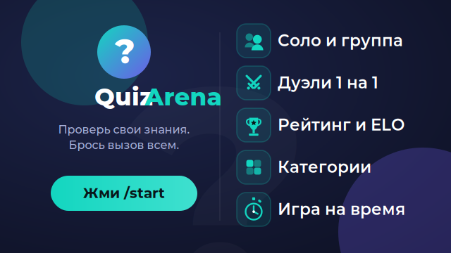
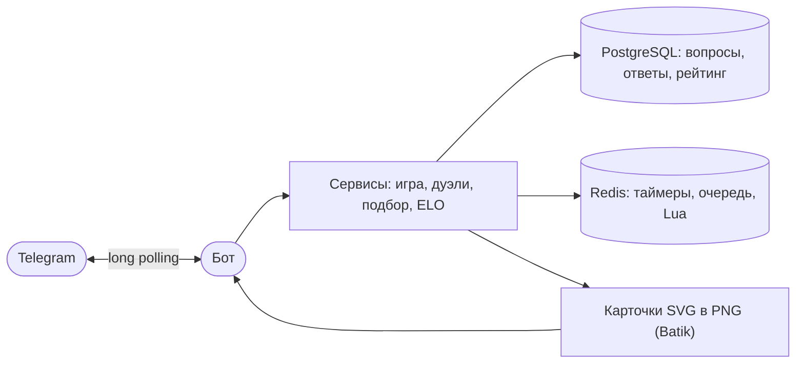

<p align="center">
  
</p>

<p align="center">
  <a href="https://github.com/Sch1z0eD/quiz-arena-telegram/actions/workflows/ci.yml"></a>
  <a href="LICENSE"></a>
  
  
  
  
  
</p>

<p align="center">
  <b>Русский</b> · <a href="README.en.md">English</a>
</p>

# QuizArena

Телеграм-бот для викторин. Можно играть в одиночку, всем чатом или сойтись один на один в дуэли — с рейтингом, лидербордами и вопросами на русском и английском.

Старт — команда `/start`, дальше всё через кнопки в меню. Бот написан на Java 21 и Spring Boot. Всё, что должно быть быстрым и атомарным — таймеры раундов, защита от двойных ответов, матчмейкинг — живёт в Redis; вопросы, ответы игроков и статистика хранятся в PostgreSQL.

## Возможности

- Соло-викторины с выбором категории и сложности.
- Групповая игра: лобби с набором участников, таймер на вопрос и бонус за скорость ответа.
- Дуэли один на один в трёх вариантах: автоподбор соперника, вызов друга по ссылке и вызов прямо из любого чата через inline-режим.
- Рейтинг ELO и лидерборды — общий, по чату и недельный.
- Профиль со статистикой, собранной из реальных ответов игрока.
- Результаты, профиль и лидерборды показываются картинкой, а не простынёй текста.
- Интерфейс на русском и английском, язык переключается в меню. Вопросы подбираются под язык игрока, а дуэли сводят только тех, у кого язык вопросов совпадает.

## Админ-панель

К боту прилагается веб-панель администратора — отдельное приложение на React в каталоге `admin-ui/`, которое общается с бэкендом по REST. Панель выключена по умолчанию и поднимается только при `admin.panel.enabled=true`; без неё приложение остаётся чистым ботом без веб-сервера.

Что умеет:

- **Дашборд** — сводка: игроки и активность, число игр по режимам, вопросы, ответы по дням, общая точность, топ категорий.
- **Вопросы** — поиск и фильтры, создание и редактирование, включение/выключение; дубликаты отсекаются по хешу текста.
- **Категории** — названия по языкам, включение/выключение, удаление.
- **Пользователи** — список со статистикой и поиском, карточка игрока, бан и разбан (бот перестаёт отвечать забаненному), пометка тех, кто сам остановил бота.
- **Рассылки** — текст с поддерживаемым Telegram подмножеством HTML, фото по ссылке или загрузкой с диска, кнопки-ссылки рядами; живое превью; dry-run с подсчётом получателей и подтверждением вводом числа; тестовая отправка себе; сегменты «все» или «по языку»; ограничение скорости и прерывание; история с прогрессом.
- **Настройки игры** — параметры геймплея (вопросов на игру, длительности таймеров, базовые очки, лобби, параметры дуэлей) меняются прямо из панели, без передеплоя и в пределах заданных границ.
- **Аудит** — журнал действий администраторов с фильтрами.

Вход — через официальный виджет Telegram Login: payload подписан и проверяется по HMAC на сервере, доступ только у Telegram-аккаунтов из списка `admin.panel.admins`. Сессия живёт в HttpOnly-куке, запросы на изменение защищены CSRF-токеном. Виджету нужен публичный домен, привязанный к боту через @BotFather (`/setdomain`) — на `localhost` он не работает, поэтому для локальной разработки есть кнопка dev-входа (профиль `dev`).

Стек фронта — React, Vite, TypeScript, Tailwind, shadcn/ui, TanStack Query. Подробности и команды — в [`admin-ui/README.md`](admin-ui/README.md).

## Как устроено



Несколько решений, на которых всё держится:

- **Виртуальные потоки.** Каждый апдейт от Telegram обрабатывается в отдельном виртуальном потоке Java 21 — медленный ответ одного игрока не блокирует остальных.
- **Атомарность через Lua.** Проверки вида «успел ли игрок ответить первым», «не ответил ли он дважды», «свести двоих из очереди» сделаны Lua-скриптами в Redis. Redis однопоточный и выполняет скрипт целиком, не прерываясь, — это закрывает гонки, которые остались бы при паре отдельных команд.
- **Единый источник правды.** Статистика и рейтинг считаются из таблицы ответов в Postgres, а не дублируются отдельными счётчиками. Так цифры не разъезжаются между собой.
- **Миграции.** Схема БД версионируется через Flyway и применяется сама при старте.
- **Картинки.** Карточки результата, профиля и лидерборда — это SVG-шаблоны, которые рендерятся в PNG через Apache Batik; кириллица берётся из вшитого шрифта DejaVu Sans.
- **Слои.** Хендлеры тонкие — только принимают апдейты; вся логика в сервисах; доступ к данным — в репозиториях и обёртках над Redis.

## Стек

- Java 21, Spring Boot 3.5
- Gradle (Kotlin DSL)
- PostgreSQL 16 + Flyway
- Redis (клиент Lettuce)
- TelegramBots 10.x, long polling
- Apache Batik — рендер SVG в PNG
- JUnit 5, Mockito, Testcontainers
- Docker / docker-compose

## Запуск

Нужен только Docker и токен бота от [@BotFather](https://t.me/BotFather). Для inline-режима (вызов на дуэль из любого чата) включи его у @BotFather командой `/setinline` и задай плейсхолдер.

### Одной командой (Docker Compose)

Поднимает приложение, Postgres и Redis; миграции применяются сами на старте.

```bash
cp .env.example .env       # впиши свой BOT_TOKEN
docker compose up
```

### Для разработки (запуск из IDE или Gradle)

Понадобится JDK 21. Инфраструктуру держим в Docker, приложение запускаем локально:

```bash
docker compose up -d postgres redis
```

Linux / macOS:

```bash
export BOT_TOKEN="сюда-токен"
./gradlew bootRun
```

Windows (PowerShell):

```powershell
$env:BOT_TOKEN="сюда-токен"
.\gradlew.bat bootRun
```

Настройки подключения к Postgres и Redis — в `application.properties`: хост и порт берутся из переменных `DB_HOST`/`DB_PORT`/`REDIS_HOST`/`REDIS_PORT` (по умолчанию `localhost`), а в Compose выставлены на имена сервисов `postgres`/`redis`.

Вопросы на русском уже идут в миграциях и подгружаются при первом старте. Английские вопросы можно один раз импортировать из [Open Trivia DB](https://opentdb.com/) — запусти приложение с `IMPORT_ENABLED=true`. Импорт идемпотентный: повторный запуск дубли не создаёт.

### Админ-панель

С включённой панелью бэкенд становится веб-приложением и слушает порт `8080`.

Linux / macOS:

```bash
export BOT_TOKEN="сюда-токен"
export SPRING_PROFILES_ACTIVE=dev
./gradlew bootRun
```

Windows (PowerShell):

```powershell
$env:BOT_TOKEN="сюда-токен"
$env:SPRING_PROFILES_ACTIVE="dev"
.\gradlew.bat bootRun
```

Профиль `dev` включает панель и dev-вход и кладёт в администраторы id `1` — впиши свой Telegram-id в `admin.panel.admins` (файл `application-dev.properties`). Без профиля задай `admin.panel.enabled=true` и `admin.panel.admins=<твой id>` вручную.

Фронт запускается отдельно:

```bash
cd admin-ui
npm install
npm run dev
```

Дев-сервер на `http://localhost:5173` проксирует `/api` на бэкенд (`:8080`). Команды и переменные окружения — в [`admin-ui/README.md`](admin-ui/README.md).

## Структура

- `handler/` — приём апдейтов: команды, колбэки кнопок, inline-запросы.
- `service/` — игровая логика: игра, дуэли, матчмейкинг, рейтинг, профиль, локализация.
- `repository/` — доступ к Postgres и обёртки над Redis.
- `bot/` — отправка сообщений и работа с Telegram API.
- Lua-скрипты — атомарные операции в Redis.
- SVG-шаблоны — карточки, которые рендерятся в картинки.
- `db/migration/` — миграции Flyway.

## Тесты

```bash
./gradlew test
```

Юнит-тесты на Mockito, интеграционные — на Testcontainers: они поднимают настоящие Postgres и Redis в Docker, так что для них нужен запущенный Docker.

## Планы

Ядро готово и работает. Что на очереди:

- Подбор дуэлей по рейтингу (сейчас соперник в пределах языка, категории и сложности выбирается случайно).
- Ачивки и ежедневный челлендж.
- Графики статистики в профиле.
